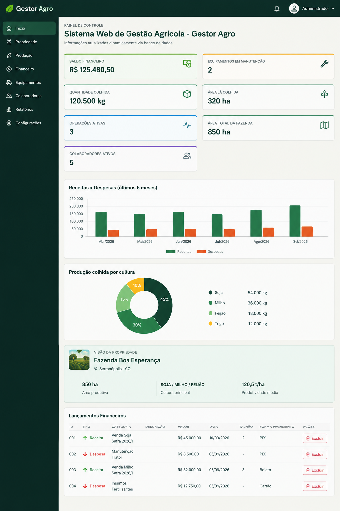

# 🌾 Gestor Agro

**Sistema web para gestão agrícola**, desenvolvido por Adriano Bueno como projeto do Bacharelado em Sistemas de Informação da Universidade Estadual de Goiás (UEG).

O Gestor Agro reúne informações da propriedade em um painel para acompanhar a produção, as finanças, os equipamentos e as atividades da equipe.

## Visão do sistema

O painel apresenta indicadores como saldo financeiro, quantidade e área colhida, operações ativas, colaboradores ativos e equipamentos em manutenção.

## Funcionalidades

| Área | O que permite acompanhar |
| --- | --- |
| 🌱 **Safras e produção** | Culturas, quantidade produzida e área cultivada ou colhida. |
| 💰 **Financeiro** | Receitas, despesas, lançamentos e formas de pagamento. |
| 🚜 **Equipamentos** | Cadastro e situação de tratores, colheitadeiras, plantadeiras e pulverizadores. |
| ⚙️ **Operações e manutenção** | Atividades com máquinas, operadores e registros de manutenção. |
| 👥 **Colaboradores e usuários** | Equipe, perfis de acesso e permissões por função. |
| 📊 **Indicadores** | Resumos visuais da produção e das finanças da propriedade. |

## Tecnologias

**PHP, PDO, MySQL, HTML, CSS, JavaScript e Bootstrap.**

## Estado do projeto

A aplicação possui uma **versão funcional**. A documentação acadêmica do TCC está em revisão para apresentação.

Este repositório público apresenta o projeto e uma imagem do painel. **O código-fonte da aplicação não está publicado aqui.**

## Autor

**Adriano Bueno** · [GitHub](https://github.com/AdrianoBuenoCruz)

Bacharelado em Sistemas de Informação · UEG
